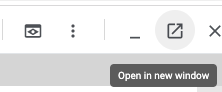

# Docker_CICD

Hi all!  These are the files that you will require to complete the exercises in the course.

## Setup

Ideally you already have Docker Desktop installed on your local machine.  Should there be 
issues with this installation, there is an online alternative:

### Alternative: Google Cloud Platform

1. You'll need a Google account

2. Go to https://console.cloud.google.com

3. Select "Activate Cloud Shell"

   

4. Select Open editor

   

5. Select Open in New Window

   

> Note: If your browser uses cookie blockers like UBlock origin you may need to disable these to get this working

