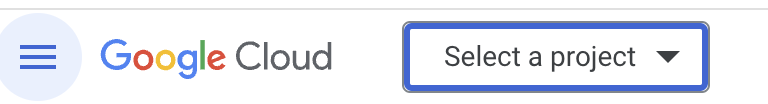
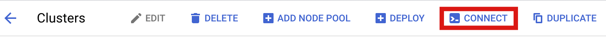

# Setup

1. You will need the tooling for Kubernetes detailed in `README.md` in the root of this project.
2. You will require a Google Cloud Platform account, details should be forwarded to the trainer.
3. The trainers will need to have provisioned a cluster for you

Once 1, 2 and 3 have been completed go to https://console.cloud.google.com/

Click on the project selector:



And fill in the name of the project provided by the trainer.  You should be able to select it.

In the search box, find and select "Kubernetes Engine" (in GCP, Search is your friend!)

In the overview select the cluster that matches your email address and then select 



You'll see a command.  If running in your local environment, copy and run this command.  If you'd prefer to use Cloud Shell, select "RUN IN CLOUD SHELL".

Test that you are able to run with 

```sh
kubectl config get-contexts
```

and you should see your `gke_enecok8s_*` cluster as selected with a `*`

## Optional - autocompletion

The `kubectl` installation instructions include additional setup for shell autocompletion, this can be useful for less typing.

- [Windows](https://kubernetes.io/docs/tasks/tools/install-kubectl-windows/#optional-kubectl-configurations-and-plugins)
- [MacOS](https://kubernetes.io/docs/tasks/tools/install-kubectl-macos/#enable-shell-autocompletion)
- [Linux](https://kubernetes.io/docs/tasks/tools/install-kubectl-linux/#enable-shell-autocompletion)

# Extra Links

- Kubectl cheat sheet: https://kubernetes.io/docs/reference/kubectl/cheatsheet/
- Kubectl docs: https://kubernetes.io/docs/home/

