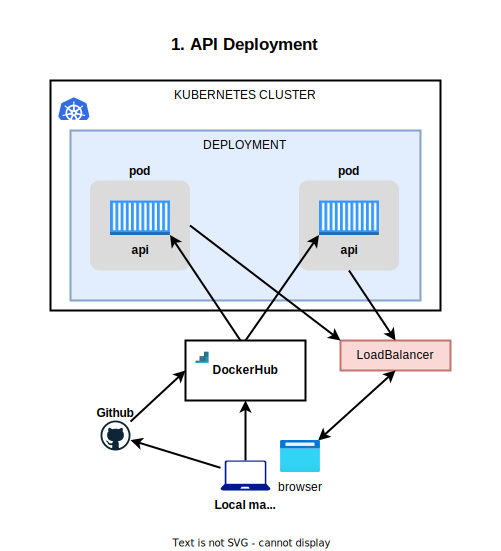
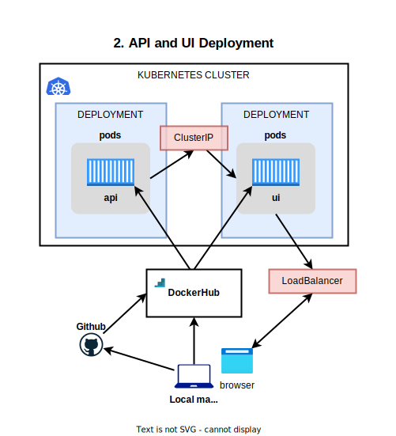
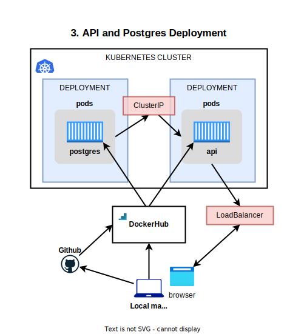
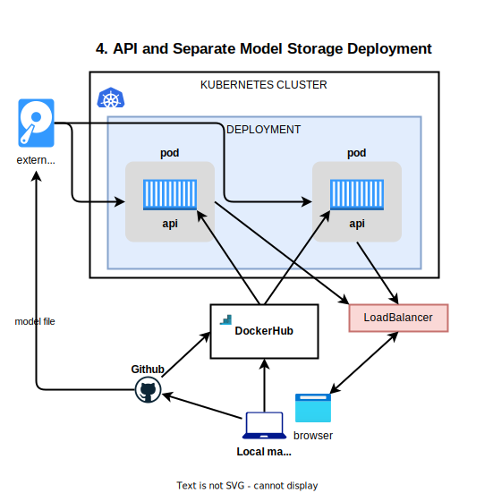

# 👩‍💻 Eneco Docker and Kubernetes Hackathon 

For the final part of the training we will do a mini-hackathon.  The main goal is to deploy a web API that provides predictions based on the legendary [Titanic survival rate machine learning use case](https://www.kaggle.com/c/titanic) as a container.

# 🌳 The Code

In this repo:

- `/api` - a [FastAPI](https://fastapi.tiangolo.com/) implementation that consists of 2 endpoints: 
  - `/preprocess/` used to preprocess the data and transform it into the format used by the model; 
  - `/predict/` to get the survival probability in percent as a response from the API.

- `/ui` - a Streamlit web UI which allows adjustment of input variables and display of eventual mapping from the `preprocess` endpoint
- `docker-compose.yaml` - already setup for running Docker Compose

# 🕵️‍♀️ What's missing?

The Dockerfiles!  You should be able to add these yourselves 💪

The code in `/api` can be run with the command `uvicorn api:api --host=0.0.0.0`

The code in `/ui` can be run with the command `streamlit run ./app.py`

Once the Dockerfiles are in place you can run the API and app using Docker Compose.

# 🧑‍🔧 CI/CD and Docker Hub

To support deployment to Kubernetes we will require the use of a container registry.  For this we will use [Docker Hub](https://hub.docker.com/) so you'll need to setup a Docker Hub account.  To deploy your image (or images) you have two options:

1. Push directly from your laptop
2. Make use of Github workflows 

## Github workflows

For Github workflows, the simplest implementation would involve building and pushing your image, see [here](https://github.com/marketplace/actions/build-and-push-docker-images) for how that would look

You can also extend it further with linting and testing of your image.  For linting, check out [hadolint](https://github.com/hadolint/hadolint) and for testing your container we'd suggest just using `curl` though there are more advanced tools you could use like [locust](https://locust.io/).

# 🚀 Deployment

For deployment there are 5 scenarios (of increasing complexity):

1. Deploy just the API
2. Deploy the API and the UI
3. Deploy the API with a lookup in a PostgreSQL instance
4. Deploy the API using Helm or Kustomize
5. Deploy just the API but mount a Disk for loading in the model

2 and 3 can, of course, be combined.

## 1. Deploy just the API

- You'll need to create a Deployment with a Pod template that uses your image in DockerHub.  
- To expose the API you can either choose to use port-forwarding or go a step further and deploy a LoadBalancer

## 2. Deploy the API and the UI

- Create a deployment for both the API and UI
- Use a ClusterIP service to allow connecting from the UI to the API.  This will require configuring of an environment variable for the API URL. The URL to connect should be `http://<service name>.<namespace name>.svc.cluster.local`. This value should be configured using a ConfigMap.
- Add liveness and readiness probes on the API which checks the `/healthz` endpoint
- To expose the UI you can either choose to use port-forwarding or deploy a LoadBalancer.

## 3. Deploy the API with a lookup in a PostgreSQL instance

- Using the example in the folder `02_kubernetes` for the Sunny Bikes image configure a lookup table from a postgres instance where passenger details can be obtained when specifying a passenger ID
- Optionally configure the api that these details can be entered via the API

## 4. Use Helm or Kustomize to deploy the API

Use Helm or Kustomize to deploy the API as a Deployment.  You should support a Development / Production setup where the number of replicas is configurable with 1 for Development and 3 for Production.

## 5. Deploy just the API but mount a Disk for loading in the model

- Deployment setup is similar to 1
- Instead of bundling the model file in the container you should deploy it to a disk
